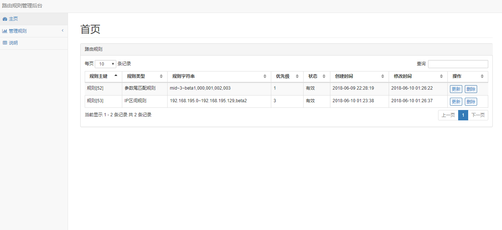
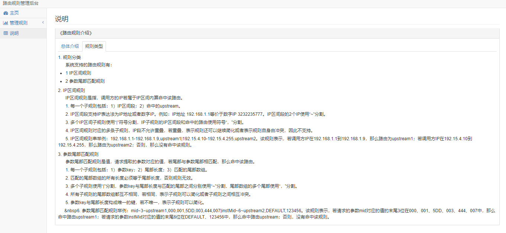

快速上手配置路由
=========================================================
&nbsp;&nbsp;&nbsp;&nbsp;nginx代理流程分为3级，第一级是总网关，根据请求和路由规则，计算出请求应该分发/跳转到那个集群，确定第二级应用网关是哪个，应用网关里面根据应用配置的反向代理，分发/跳转到指定应用集群。

&nbsp;&nbsp;&nbsp;&nbsp;本文主要介绍如何搭建一个最简单的路由分发系统，如上图所示，需要配置入口网关和3个应用网关。

# 1. 搭建入口网关

## 1.1 总配置文件

&nbsp;&nbsp;&nbsp;&nbsp;其中需要注意几个include进来的几个子配置项，后面详细说明作用。lua_package_path指的是lua代码的目录，需要配置lua路由逻辑代码的绝对路径和依赖的lua库的路径。

~~~config
worker_processes auto;

error_log  /opt/nginx/logs/error.log;
pid        /opt/nginx/logs/nginx.pid;

events {
    use epoll;
    worker_connections  10240;
}

http {
    server_tokens off;

    sendfile on;

    tcp_nodelay on;
    tcp_nopush on;
    keepalive_timeout  0;
    charset utf-8;

    include mime.types;
    default_type application/json;

    log_format  main '[$time_local]`$http_x_up_calling_line_id`"$request"`"$http_user_agent"`$staTus`[$remote_addr]`$http_x_log_uid`"$http_referer"`$request_time`$body_bytes_sent`$http_x_forw
arded_proto`$http_x_forwarded_for`$http_host`$http_cookie`$upstream_response_time`xd';

    client_header_buffer_size 4k;
    large_client_header_buffers 8 4k;
    server_names_hash_bucket_size 128;
    client_max_body_size 8m;

    client_header_timeout 30s;
    client_body_timeout 30s;
    send_timeout 30s;
    lingering_close off;

    gzip on;
    gzip_vary on;
    gzip_min_length  1000;
    gzip_comp_level  6;
    gzip_types text/plain text/xml text/css application/javascript application/json;
    gzip_http_version 1.0;

    include route-upstream.conf;
    include route-vhost.conf;
    include route-admin.conf;

    lua_package_path "/usr/local/share/luajit-2.0.5/jit/?.lua;/opt/nginx/route-master/src/?.lua;;";
    lua_need_request_body on;
}
~~~

## 1.2 子配置项route-upstream

&nbsp;&nbsp;&nbsp;&nbsp;该配置项是配置所有集群分组需要转发的应用网关的地址和端口，当入口流量经过总网关后，会根据规则计算出应用路由的upstream，然后路由到对应应用网关。

~~~config
upstream stable {
	server 127.0.0.1:8020 weight=3 fail_timeout=10 max_fails=3;
	keepalive 1000;
}

upstream beta1 {
	server 127.0.0.1:8021 weight=3 fail_timeout=10 max_fails=3;
	keepalive 1000;
}

upstream beta2 {
	server 127.0.0.1:8022 weight=3 fail_timeout=10 max_fails=3;
	keepalive 1000;
}
~~~

## 1.3 子配置项route-vhost

&nbsp;&nbsp;&nbsp;&nbsp;该配置项是用来拦截入口流量的，拦截规则是/（即所有请求），路由规则在Route.lua中计算出来，然后跳转到对应的应用网关。

~~~confg
server {
    listen  80;

    access_log /opt/nginx/logs/route-vhost_access.log  main;
    error_log  /opt/nginx/logs/route-vhost_error.log;

    proxy_redirect off;
    proxy_set_header Host $host;
    proxy_set_header X-Forwarded-For $remote_addr;

    location / {
        error_log  /opt/nginx/logs/route-vhost_error.log debug;
        set $upstream 'stable';

        rewrite_by_lua_file '/opt/nginx/route-master/src/route/Route.lua';
        proxy_pass http://$upstream;
    }
}
~~~

# 2. 应用网关配置

&nbsp;&nbsp;&nbsp;&nbsp;应用网关分为3个集群，分别为stable、beta1、beta2，根据业务还可以配置更多，其中测试使用地址/test，三个集群配置各如下：

~~~config
worker_processes auto;

pid /opt/nginx/logs/stable.pid;
error_log /opt/nginx/logs/error_stable.log ;

events {
    worker_connections 32768;
    use epoll;
}

http {
    include       mime.types;
    default_type  text/plain;

    log_format  main  '$remote_addr - $remote_user [$time_local] "$request" '
    '$status $body_bytes_sent "$http_referer" '
    '"$http_user_agent" "$http_x_forwarded_for"';

    sendfile        on;

    keepalive_timeout  75;
    keepalive_requests 32768;

    access_log /opt/nginx/logs/access_stable.log;

    server {
        listen 8020;
        server_name localhost;

        error_page   500 502 503 504  /50x.html;
        location = /50x.html {
            root   html;
        }

        location /test {
            content_by_lua '
                ngx.say("this is stable /test")
            ';
        }

    }
}
~~~

~~~config
worker_processes auto;

pid /opt/nginx/logs/beta1.pid;
error_log /opt/nginx/logs/error_beta1.log ;

events {
    worker_connections 32768;
    use epoll;
}

http {
    include       mime.types;
    default_type  text/plain;

    log_format  main  '$remote_addr - $remote_user [$time_local] "$request" '
    '$status $body_bytes_sent "$http_referer" '
    '"$http_user_agent" "$http_x_forwarded_for"';

    sendfile        on;

    keepalive_timeout  75;
    keepalive_requests 32768;

    access_log /opt/nginx/logs/access_beta1.log;

    server {
        listen 8021;
        server_name localhost;

        error_page   500 502 503 504  /50x.html;
        location = /50x.html {
            root   html;
        }

        location /test {
            content_by_lua '
                ngx.say("this is beta1 /test")
            ';
        }

    }
}
~~~

~~~config
worker_processes auto;

pid /opt/nginx/logs/beta2.pid;
error_log /opt/nginx/logs/error_beta2.log ;

events {
    worker_connections 32768;
    use epoll;
}

http {
    include       mime.types;
    default_type  text/plain;

    log_format  main  '$remote_addr - $remote_user [$time_local] "$request" '
    '$status $body_bytes_sent "$http_referer" '
    '"$http_user_agent" "$http_x_forwarded_for"';

    sendfile        on;

    keepalive_timeout  75;
    keepalive_requests 32768;

    access_log /opt/nginx/logs/access_beta2.log;

    server {
        listen 8022;
        server_name localhost;

        error_page   500 502 503 504  /50x.html;
        location = /50x.html {
            root   html;
        }

        location /test {
            content_by_lua '
                ngx.say("this is beta2 /test")
            ';
        }

    }
}
~~~

&nbsp;&nbsp;&nbsp;&nbsp;如上应用网关配置就按照应用的需要配置相应路由即可，核心的路由计算逻辑都在入口网关里面，应用网关只管应用网关的业务逻辑。

# 3. 路由规则管理平台

&nbsp;&nbsp;&nbsp;&nbsp;提供了一个路由规则管理平台，前台是纯html（bootstrap模板）+后台（纯lua编写的），由于没有设置响应的权限等逻辑，因此配置nginx时候需要deny all，只allow有权限访问路由规则管理后台的几台内网IP地址即可，或者在此基础上二次开发支持权限相关的逻辑。

## 3.1 
&nbsp;&nbsp;&nbsp;&nbsp;搭建的测试后台还是在总网关上面，在子配置项route-admin.conf里面配置。另外测试的后台也是允许跨域的，你可以根据自己的实际情况选中，只需要注意admin的入口Admin.lua的路径选择。

~~~config
server {
	listen 8080;
	server_name localhost 127.0.0.1 192.168.195.128;
	access_log /opt/nginx/logs/admin-access.log  main;
	error_log  /opt/nginx/logs/admin-err.log error;
	
	location /admin {
		add_header Access-Control-Allow-Origin "*";
		add_header Access-Control-Allow-Methods "POST, GET, OPTIONS";
		add_header Access-Control-Allow-Headers "X-Requested-With";

		default_type 'application/json';
		content_by_lua_file '/opt/nginx/route-master/src/admin/Admin.lua';
	}

	location / {
		root /opt/nginx/route-master/route-admin;
		index index.html index.htm;
	}
}
~~~

## 3.2 规则配置后台展示

&nbsp;&nbsp;&nbsp;&nbsp;规则配置后台允许规则的添加、更新、修改，另外由于规则配置比较复杂，单独提供了用户手册，集成在后台帮助模块里面。

- 1. 规则配置页面

- 2. 规则配置帮助页面

